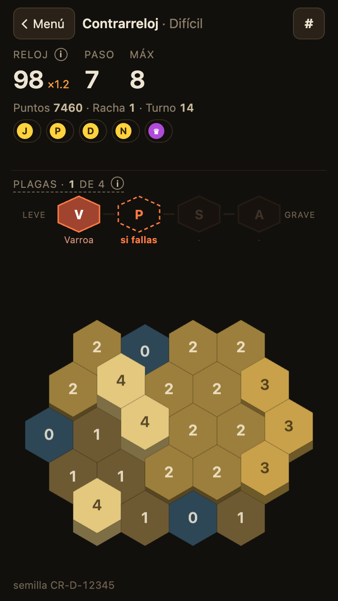

# La Colmena

**Jugar**: https://icaraballo.github.io/La-Colmena/ · gratis, en el navegador del móvil o del ordenador.

Puzzle de panal hexagonal. La mecánica está inspirada en un juego de móvil de 2012 que ya no
funciona; todo lo demás (tema, nombre, arte, textos y código) es propio y está hecho desde cero.

<p align="center"></p>

## Cómo se juega

El panal es el ciclo de cría de una abeja, con el agua debajo:
**agua → cera → huevo → larva → operculada → abeja**.

1. Arrastras sobre un grupo de celdas conectadas que estén **todas al mismo nivel**, y suben un
   nivel.
2. Cada turno hay que arrastrar **exactamente una celda más** que el anterior.

Cuando las celdas llegan a abeja se **cosechan**: la abeja sale volando y la celda vuelve a
agua. Si el siguiente paso no cabe en ningún sitio, fallas: el paso vuelve a 1. Por el panal
salen **ítems** (jalea real, propóleo, danza, néctar, humo, la reina) que se recogen pasando la
cadena por encima.

## Modos

- **Contrarreloj**: cosecha para ganar tiempo. Un reloj de 90 s que acelera; cada fallo trae una
  plaga (varroa, polilla, seda, velutina) y sólo una cosecha grande te las quita.
- **Invierno**: evita congelarte. Sin reloj; cada fallo, la helada rompe celdas del borde para
  siempre.
- **Contagio**: frena la plaga. Las mismas plagas, sin reloj y con turnos contados: dejan celdas
  marcadas que se contagian, y cada una que quede al final resta puntos.
- **Expansión**: abre el panal, celda a celda. Empiezas en el centro y las cosechas grandes abren
  el anillo cerrado; gana quien lo completa en menos turnos.
- **Puzzle**: encuentra el camino. 75 niveles en 5 capítulos, cada uno con un objetivo y un límite
  de turnos, con estrellas, pista y solución guiada si te atascas.
- **Panal libre**: para practicar, sin presión y sin puntos.

Y un **tutorial** de 8 niveles cortos para aprender las reglas jugando. Los cuatro primeros modos
tienen normal y difícil, récords y un historial de partidas; cada partida tiene un código
(`CR-N-4069568398`) para repetirla o retar a alguien con el mismo panal.

## Cómo está hecho

- **Vanilla JS, sin dependencias** ni framework ni bundler: el navegador carga `js/*.js` como
  scripts clásicos. GitHub Pages sirve la rama `main` tal cual.
- **El motor es puro**: el estado de la partida es un objeto plano y serializable, sin canvas ni
  DOM, y todo el azar sale de una semilla. Por eso una partida se puede guardar, compartir con su
  código y rejugar exacta.
- **Bots que juegan miles de partidas**: cinco niveles de jugador, del que sólo cosecha cuando puede al que
  planifica. Cada cambio de reglas se mide con ellos antes de decidirlo.
- **Una máquina que fabrica los puzles** (`puzles/`, fuera del juego): juega una partida guía y
  convierte lo jugado en el objetivo, así que cada nivel tiene solución por construcción; un
  buscador demuestra el mínimo de turnos, un comprobador rejuega la solución con su propio código
  y un evaluador mide cómo de difícil es para quien no la conoce.
- **Tests** de las reglas, del guardado, del historial y de los niveles: `npm test` y
  `npm run test:puzles`.
- **Desarrollado con Claude**: el diseño, conversado en Claude.ai; el código, escrito con
  Claude Code.

## Estructura

```
index.html        HTML + CSS
js/constants.js   panal, niveles, modos, tablas y textos que llevan números
js/state.js       estado y reglas: funciones puras, sin DOM y con azar con semilla
js/bot-tonto.js   el jugador más sencillo (también mueve el panal de la portada)
js/guardado.js    la partida a medias: convertir y validar, sin tocar localStorage
js/historial.js   el código de cada partida y Tus partidas: funciones puras
js/puzles.js      los niveles del modo Puzzle (sólo datos)
js/tutorial.js    los niveles del tutorial (sólo datos)
js/pista.js       la pista de Puzzle, con el buscador de la máquina
js/render.js      canvas: el panal en falso 2.5D
js/input.js       el arrastre: tránsito, quitar volviendo atrás, cancelar fuera
js/app.js         arranque, pantallas, HUD, reloj y bucle de dibujo
img/              la tarjeta del enlace, los iconos y la captura (img/fuente, cómo se hacen)
tests/smoke.js    pruebas                                  · npm test
tests/bot.js      simulador de partidas                    · npm run bot [n] [semilla] [modo] [dificultad]
puzles/           la máquina de puzles                     · npm run puzles -- generar · npm run test:puzles
```

## Licencia

Todos los derechos reservados: ver [LICENSE](LICENSE).
